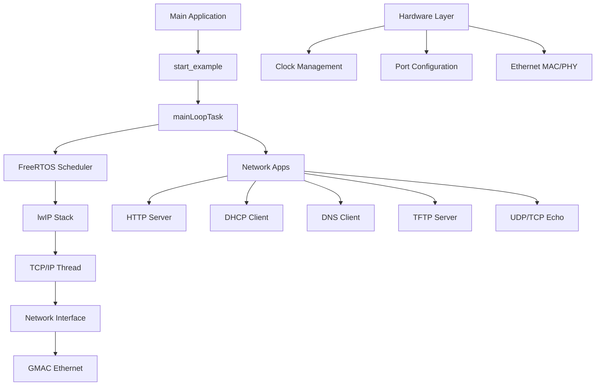
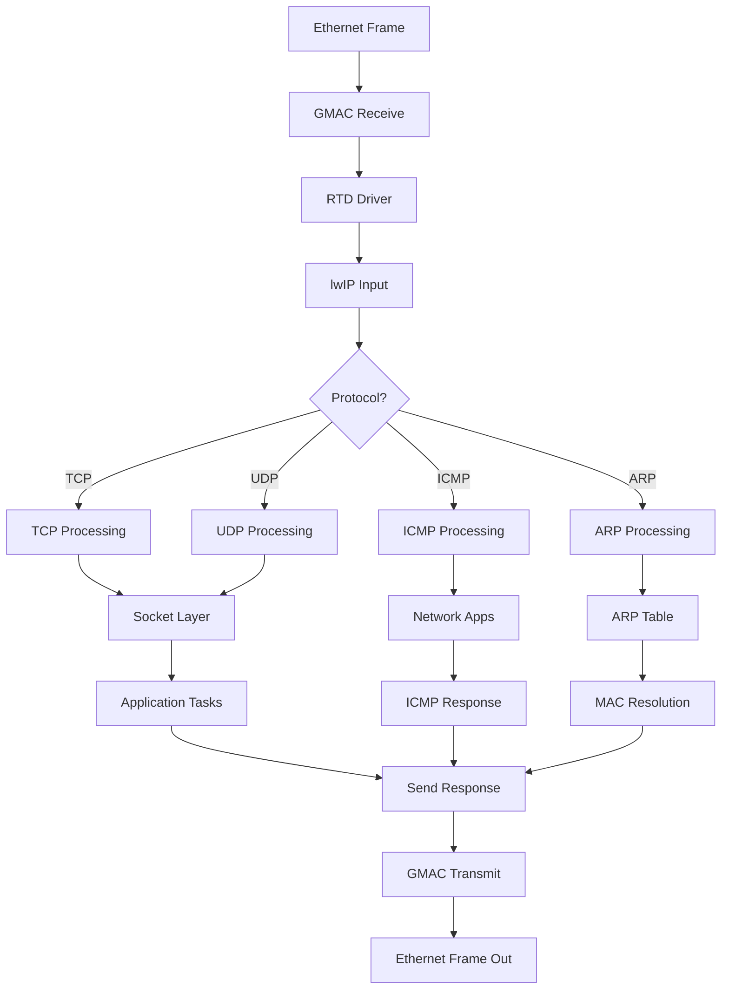
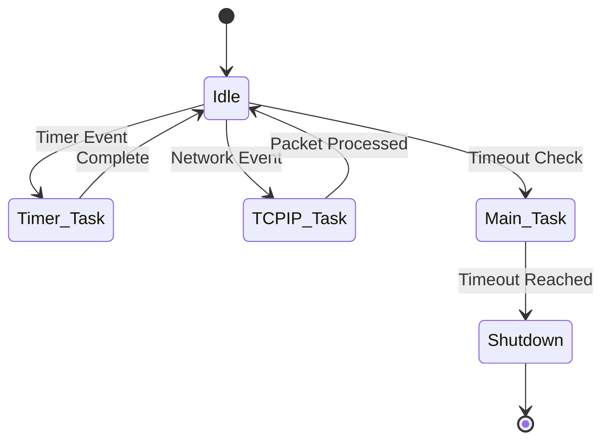
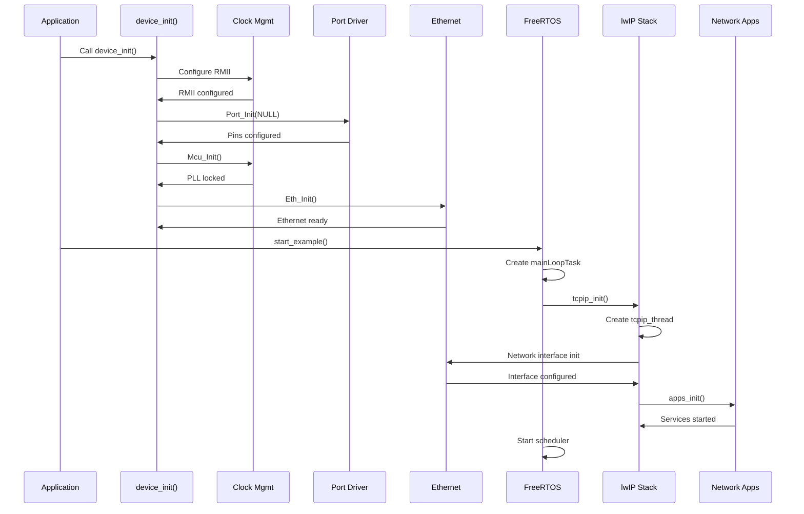
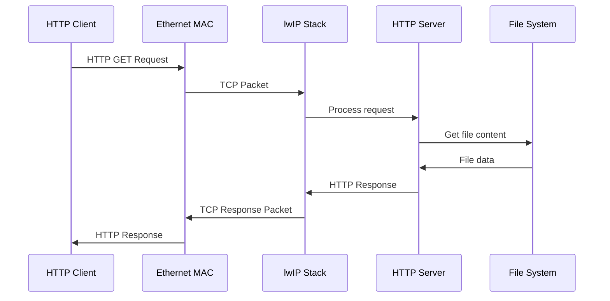
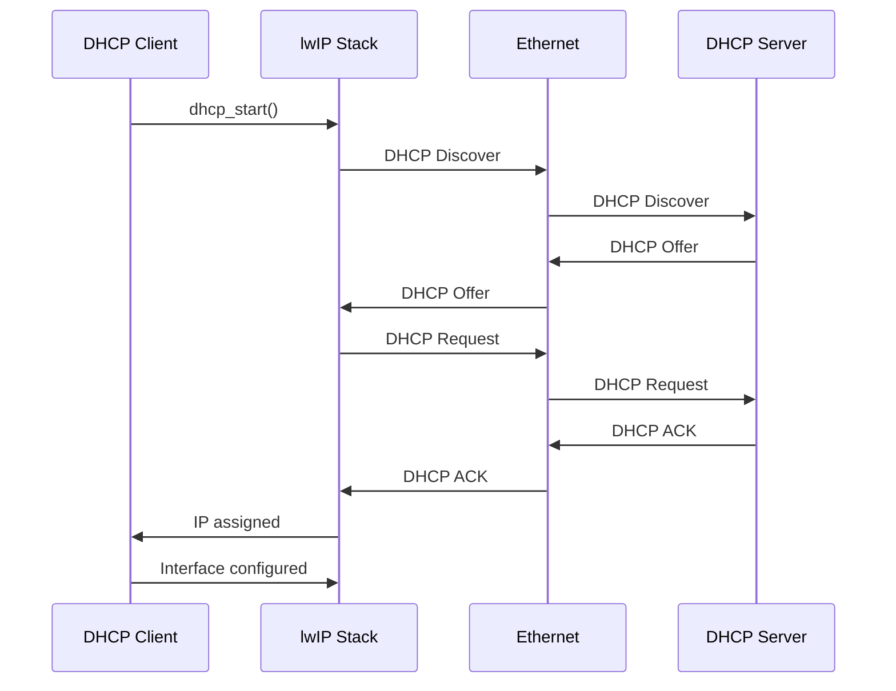
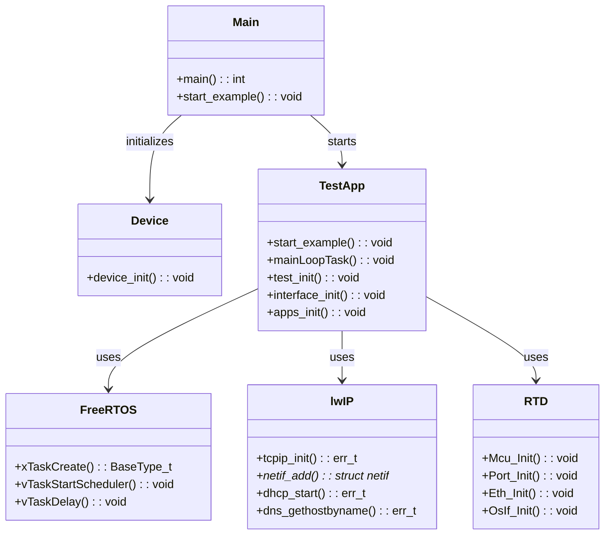
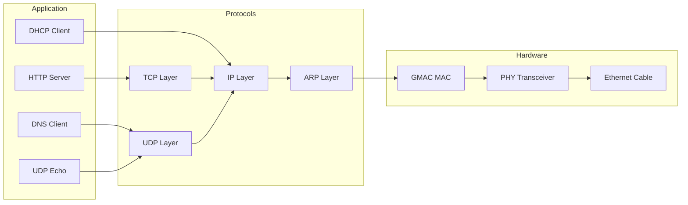
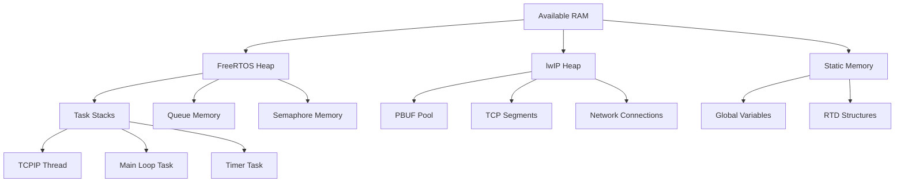

# OTA UDS lwIP FreeRTOS Bootloader for S32K344 - System Specification

## 1. System Overview

This specification documents the embedded network communication system running on the NXP S32K344 microcontroller. The system integrates FreeRTOS real-time operating system with the lwIP TCP/IP stack to provide comprehensive network services, serving as a foundation for Over-The-Air (OTA) updates and Unified Diagnostic Services (UDS) protocol implementation.

### 1.1 Purpose
- Provide network communication capabilities for embedded systems
- Enable remote firmware updates (OTA)
- Support diagnostic communication (UDS)
- Serve as a robust platform for industrial and automotive applications

### 1.2 Scope
The system implements:
- Network protocol stack (IPv4/IPv6, TCP/UDP)
- Multiple network services (HTTP, DHCP, DNS, TFTP, etc.)
- Real-time operating system integration
- Hardware abstraction through RTD (Real-Time Drivers)

## 2. System Architecture

### 2.1 High-Level Architecture

```
┌─────────────────┐    ┌──────────────────┐    ┌─────────────────┐
│   Application   │    │   FreeRTOS OS    │    │   Network Apps  │
│     Layer       │◄──►│   Task Scheduler │◄──►│   HTTP, DNS,    │
│                 │    │   Memory Mgmt    │    │   DHCP, TFTP    │
└─────────────────┘    └──────────────────┘    └─────────────────┘
         ▲                       ▲                       ▲
         │                       │                       │
┌─────────────────┐    ┌──────────────────┐    ┌─────────────────┐
│ Network Drivers │    │    lwIP Stack    │    │   Application   │
│  GMAC Ethernet  │◄──►│ TCP/IP Protocols │◄──►│     APIs         │
│   Controller    │    │ Socket Interface │    │   Socket, Netconn│
└─────────────────┘    └──────────────────┘    └─────────────────┘
         ▲                       ▲                       ▲
         │                       │                       │
┌─────────────────┐    ┌──────────────────┐    ┌─────────────────┐
│   RTD Drivers   │    │   MCU Hardware   │    │   External      │
│ Ethernet, Clock │◄──►│   S32K344 MCU    │◄──►│   Networks      │
│ Port, MCU, etc. │    │ ARM Cortex-M7    │    │   Devices       │
└─────────────────┘    └──────────────────┘    └─────────────────┘
```

### 2.2 Component Relationships



## 3. Component Specifications

### 3.1 Hardware Layer (S32K344 MCU)

#### Key Features:
- **Processor**: ARM Cortex-M7 @ 160MHz
- **Memory**: 4MB Flash, 128KB Data Flash, 64KB ITCM
- **Ethernet**: GMAC controller with RMII interface
- **Peripherals**: Standard automotive peripherals

#### Initialization Sequence:
1. Clock configuration (PLL setup)
2. Port initialization (pin multiplexing)
3. Ethernet MAC configuration
4. Interrupt controller setup

### 3.2 Operating System Layer (FreeRTOS)

#### Configuration:
- **Tick Rate**: 1000Hz
- **Max Priorities**: 10
- **Heap Size**: 65KB
- **Task Stack Size**: 512 bytes minimum

#### Task Structure:
```
┌─────────────────┐
│ TCPIP Thread    │ Priority: 1, Stack: 8192 bytes
├─────────────────┤
│ Main Loop Task  │ Priority: 1, Stack: 256 bytes
├─────────────────┤
│ Timer Service   │ Priority: 2, Stack: 180 bytes
├─────────────────┤
│ Idle Task       │ Priority: 0, Lowest priority
└─────────────────┘
```

### 3.3 Network Stack Layer (lwIP)

#### Configuration:
- **IPv4/IPv6**: Dual stack support
- **TCP Window**: 11680 bytes
- **UDP Support**: Enabled
- **DHCP**: Disabled (static IP by default)
- **Memory**: 64KB heap allocation

#### Protocol Support:
- TCP (MSS: 1460 bytes)
- UDP (TTL: 255)
- ICMP Ping
- ARP (Table size: 10)
- DNS Resolution
- AutoIP (169.254.x.x range)

### 3.4 Application Layer

#### Network Services:
1. **HTTP Server**: File serving, web interface
2. **DHCP Client**: Dynamic IP configuration
3. **DNS Client**: Domain name resolution
4. **TFTP Server**: File transfer protocol
5. **UDP/TCP Echo**: Connectivity testing
6. **SNMP**: Network management
7. **NTP**: Time synchronization
8. **mDNS**: Service discovery
9. **SNMP**: Network management

## 4. Data Flow Diagrams

### 4.1 System Initialization Flowchart

```mermaid
flowchart TD
    A[Power On] --> B[MCU Reset]
    B --> C[device_init()]
    C --> D[RMII Configuration]
    D --> E[Port Initialization]
    E --> F[Clock Setup]
    F --> G[Mcu_Init]
    G --> H[PLL Lock Wait]
    H --> I[Mcu_DistributePllClock]
    I --> J[OsIf_Init]
    J --> K[Platform_Init]
    K --> L[Eth_Init]
    L --> M[start_example]
    M --> N[mainLoopTask]
    N --> O[tcpip_init]
    O --> P[test_init]
    P --> Q[interface_init]
    Q --> R[Network Apps Init]
    R --> S[Main Loop]
```

### 4.2 Network Packet Processing Flow



### 4.3 Task Scheduling Flow



## 5. Sequence Diagrams

### 5.1 System Boot Sequence



### 5.2 HTTP Request Processing



### 5.3 DHCP IP Assignment



## 6. Relationship Diagrams

### 6.1 Class Diagram - Core Components



### 6.2 Component Interaction Diagram



### 6.3 Memory Management Diagram



## 7. Configuration and Parameters

### 7.1 Network Configuration
```c
// Network Interface Configuration
#define ETHIF_NUMBER           1U
#define IFACE0_IP_ADDR         "10.42.0.200"
#define IFACE0_NETMASK         "255.255.255.0"
#define IFACE0_GATEWAY         "10.42.0.1"
```

### 7.2 FreeRTOS Configuration
```c
#define configTOTAL_HEAP_SIZE               ((size_t)65535)
#define configMAX_PRIORITIES                10
#define configTICK_RATE_HZ                  ((TickType_t)1000)
#define TCPIP_THREAD_STACKSIZE              8192
```

### 7.3 lwIP Configuration
```c
#define TCP_WND                        11680
#define TCP_SND_BUF                    11680
#define MEM_SIZE                       65535
#define PBUF_POOL_SIZE                 0  // Custom pools used
```

## 8. Performance Characteristics

### 8.1 Timing Requirements
- System boot time: < 2 seconds
- Network interface initialization: < 500ms
- DHCP address acquisition: < 30 seconds
- TCP connection establishment: < 100ms

### 8.2 Memory Usage
- FreeRTOS heap: 64KB allocated
- lwIP heap: 64KB allocated
- Task stacks: Variable (4KB-8KB per major task)
- Network buffers: 8 Rx, 8 Tx descriptors

### 8.3 Throughput
- Ethernet: 100Mbps RMII interface
- TCP throughput: Limited by MCU processing
- UDP throughput: Near wire speed for small packets

## 9. Error Handling and Recovery

### 9.1 Error Conditions
- Network cable disconnection
- DHCP server unavailable
- Memory allocation failures
- TCP connection timeouts
- Hardware initialization failures

### 9.2 Recovery Mechanisms
- Automatic IP reconfiguration (DHCP to AutoIP fallback)
- Network interface restart on failure
- Memory cleanup on allocation errors
- Timeout-based shutdown for testing
- Watchdog reset on critical failures

## 10. Future Extensions

### 10.1 OTA Update Support
- TFTP-based firmware download
- Flash memory management
- Image validation and verification
- Rollback mechanisms

### 10.2 UDS Protocol Implementation
- ISO 14229 compliant services
- Diagnostic session management
- ECU reprogramming support
- Security access controls

### 10.3 Security Enhancements
- TLS/SSL support for secure communications
- Secure boot verification
- Encrypted firmware updates
- Authentication mechanisms

---

*This specification provides the foundation for implementing network-enabled embedded systems with OTA and UDS capabilities on the S32K344 platform.*
